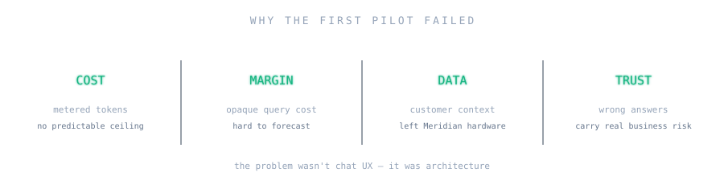
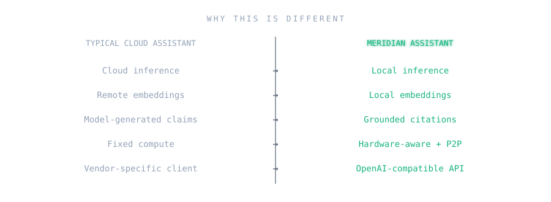
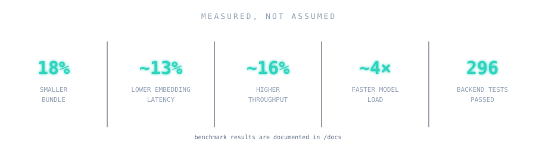
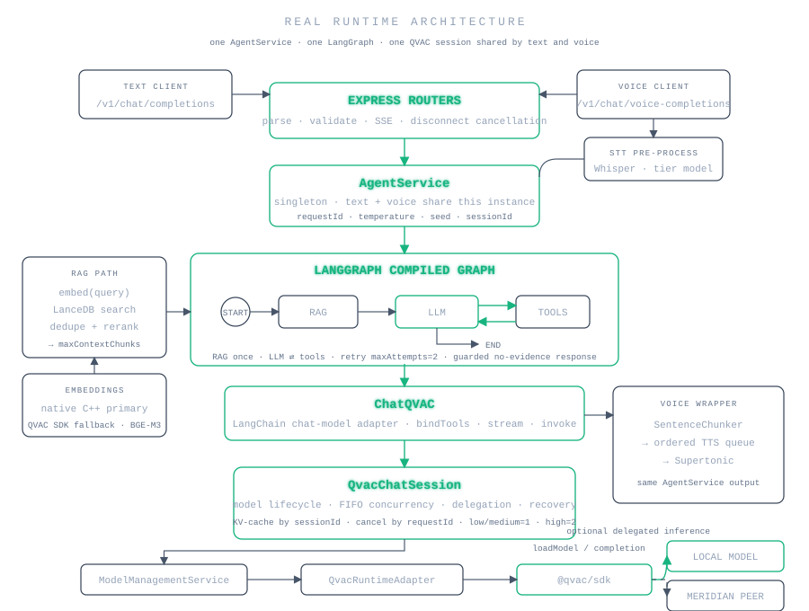
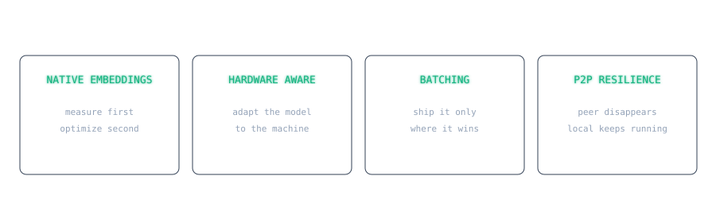
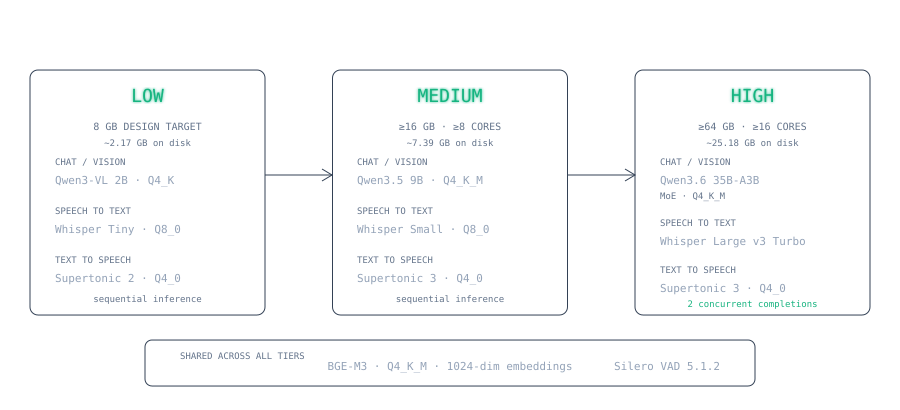
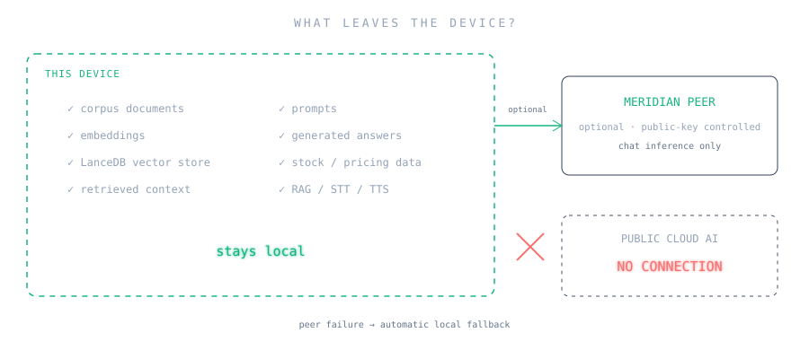
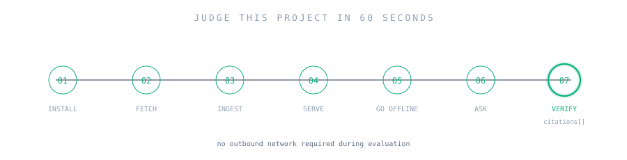

> Private company knowledge. Available anywhere. Without sending it anywhere.

```text
$ meridian status

inference        LOCAL        chat + voice + vision (QVAC / llama.cpp)
embeddings       LOCAL        BGE-M3, 1024-dim, native C++ path + SDK fallback
vector store     LOCAL        LanceDB, file-backed, persisted on disk
cloud ai         DISABLED     no API keys, no outbound inference calls
offline          READY        after one `models:fetch` (weights are cached)
```

*Not affiliated with or endorsed by Tether or the QVAC project. "QVAC" and "Meridian Components" are used here only to describe what this project integrates with and who it was built for.*

---

## What this is

Meridian Assistant is a local-first knowledge and inference layer for Meridian Components. It answers sales, support, and field-engineering questions grounded in Meridian's own documents and live inventory, runs entirely on hardware Meridian controls, and exposes an OpenAI-compatible API so it drops into the chat interface Meridian already has — no cloud model provider in the loop.

It is built on **QVAC**: `@qvac/sdk` for local model lifecycle, inference, embeddings, speech-to-text and text-to-speech; LangGraph for the agent loop; LanceDB for the persisted vector store.

<!-- DEMO GIF:
Show: a field engineer asks a question by voice ("What's the warranty on the ServoDrive X4?") →
the engine panel shows the local model answering → the streamed text response appears → a
citation card expands showing the source document. Target length: 10-15 seconds. Capture with
the backend already warm (npm run serve) so the GIF shows inference, not model loading.
-->

---

## The problem



Meridian piloted a cloud AI assistant and shut it down. Four reasons kept surfacing:

- **Cost** — usage-based pricing with no ceiling, on a workload (customer calls, field questions) that was only going to grow.
- **Margin clarity** — a vendor-hosted model is a black box on cost-per-query; nobody could tell finance what it would cost at scale.
- **Data exposure** — every question sent customer names, pipeline figures, and commercial terms to a third party.
- **Trust in the answers** — a wrong price or a fabricated SLA in front of a customer is worse than no answer at all.

Those aren't UX complaints. They're the reasons a COO cancels a vendor and a Head of IT & Security refuses to re-approve one.

## What we built

A monorepo (npm workspaces) with:

- **`apps/backend`** — an Express API wrapping QVAC's local model lifecycle, a LangGraph chat orchestrator with structured tool calling and RAG grounding, speech-to-text/text-to-speech, and the corpus ingest pipeline.
- **`apps/frontend`** — a React + Vite chat client: streaming answers, citation cards, voice input/output, image attachments, an engine panel showing what's actually running, and P2P delegation status.
- **`stock-tool`** — a deterministic Meridian inventory dataset and query function, wired into the agent as a structured tool.
- **`corpus/`** — the provided Meridian document set (emails, reports, policies, transcripts, pricing, two photos), ingested into a local vector store.
- **QVAC model-serving config** (`apps/backend/qvac.config.mjs`) — pins the local cache location and the exact plugin set this product uses.

Every one of those runs with no outbound call to a cloud model provider — not as a toggle, but because no cloud AI client exists anywhere in the dependency tree.

## Why local-first solves it

Every piece of the answer path — embedding the question, searching the vector store, building context, running the model — happens on hardware Meridian controls. No cloud AI client exists in the dependency tree for any of it; see [Architecture](#architecture) for the full diagram.

- **Cost** becomes fixed hardware, not metered tokens — finance can model it.
- **Margin clarity** follows directly: no per-query vendor invoice to forecast.
- **Data exposure** stops being a policy promise and becomes an architectural fact — see [Security](#security--what-leaves-the-device) for exactly what persists and what doesn't.
- **Trust in answers** comes from grounding every claim in a retrieved document and citing it, and from an explicit refusal path when nothing in the corpus supports an answer — not from a bigger model guessing more confidently.

## Why this is different



This isn't a thin wrapper around a hosted chat completion. The things that make it a real QVAC integration rather than an API client:

- **True local inference** — `@qvac/sdk` loads and runs GGUF models on-device; no HTTP call to any model provider exists in the request path.
- **Persistent local vector store** — a file-backed LanceDB table, built with the SDK's `embed()`/`ragChunk()` primitives directly, not QVAC's own `ragIngest()`/`ragSearch()` workspace (excluded by the challenge's own requirement for this piece).
- **Grounded citations** — a deterministic `{file, score}` array on every answer, derived from what actually passed the retrieval threshold, not generated by the model.
- **OpenAI-compatible API** — `POST /v1/chat/completions`, streaming and non-streaming, works against a stock OpenAI SDK client.
- **Full model lifecycle management** — discover, provision (download without loading), load, infer, unload, close — each a separate, independently-testable step.
- **Runtime hardware-aware model selection** — RAM/CPU detected once per process and mapped to a tier, each tier loading a different chat/STT/TTS model.
- **P2P delegated inference with automatic local fallback** — offload the chat model to a Meridian-controlled peer by public key, with heartbeat health checks and transparent fallback to local inference.
- **Streaming + cancellation by request id** — SSE token streaming; cancelling one in-flight completion never disturbs a concurrent sibling.
- **Multimodal voice and vision** — speech in/out on the same orchestrator, and image attachments through the same chat path.
- **Structured tool calling** — Zod-validated tool schemas (`lookup_stock`, `list_documents`) driven off the agent's own tool-call events, not regex-scraped text.
- **KV-cache reuse** — per-session cache, grouped by a session header, explicitly freed on "new chat".
- **Plugin-scoped lean build** — the shipped SDK bundle includes only the four plugins this product uses, not QVAC's full plugin catalog.

Two improvements beyond the baseline were attempted, measured, and reported honestly either way — see [Technical challenges solved](#technical-challenges-solved):

- **Native C++ embedding path** — integrated into production RAG as the primary path, with automatic fallback to the SDK path.
- **Continuous batching** — implemented and shipped only where it measured a real gain; reverted to sequential on the tier where it measured a loss.
- **TurboQuant KV-cache quantization** — the engine config is implemented and available via a flag; not enabled by default on any tier yet, pending its own validation.

## Key capabilities

| Capability | What it does |
|---|---|
| **Chat** | `POST /v1/chat/completions` — OpenAI-compatible, streaming or not, grounded by retrieval, with tool calling for inventory questions |
| **Citations** | Every answer carries `citations: [{file, score}]`, in both streaming and non-streaming responses; empty on a refusal |
| **Voice** | `POST /v1/chat/voice-completions` — speech in, speech out, streamed sentence-by-sentence; a standalone `/api/tts` for text-to-speech alone |
| **Vision** | OpenAI Vision-style `image_url` content parts on `/v1/chat/completions`; JPEG/PNG, magic-byte sniffed (not trusted from the client), WebP auto-transcoded |
| **Stock lookup** | A structured tool backed by a frozen Meridian inventory snapshot; unknown SKUs return suggestions, never an invented quantity |
| **Local model management** | `/api/models` — discover, download, load, run, unload, close any QVAC registry or URL-sourced model |
| **RAG / corpus ingestion** | Incremental, content-hash-based ingest into LanceDB; unchanged documents are never re-embedded |
| **P2P delegated inference** | Offload the chat model to a trusted peer by public key, with automatic local fallback |
| **Hardware-aware tiers** | RAM/CPU detected once per process; chat/STT/TTS model selection follows automatically |
| **Cancellation** | Preload, chat completions (SSE disconnect), TTS, and model inference each support cancellation |

<!-- SCREENSHOT:
File: docs/assets/engine-panel.png
Show: the frontend's engine panel card with a real session loaded — the active chat model name,
the resolved hardware tier badge (low/medium/high), and the delegation status line ("Running
locally" or "Running on remote peer" with a truncated public key). Should make it obvious at a
glance what the assistant is actually running on, without reading any code.
-->

<!-- SCREENSHOT:
File: docs/assets/citation-card.png
Show: a chat answer with its citation hover card expanded — the cited document path(s) and
score(s) visible, demonstrating that the answer is grounded in a real corpus file rather than
generated from the model's own knowledge.
-->

## Proven, not mocked



| Metric | Value | Source |
|---|---|---|
| Plugin-scoped SDK bundle vs. full SDK | 9.6 MB vs 11.8 MB (18% smaller) | `docs/bundle-size-report.md` |
| Native embedding — avg latency vs. SDK path | ~13% lower | `docs/i4-native-addon-results.md` |
| Native embedding — throughput vs. SDK path | ~16% higher | `docs/i4-native-addon-results.md` |
| Native embedding — model load time vs. SDK path | ~4x faster | `docs/i4-native-addon-results.md` |
| Continuous batching, `medium` tier, measured | 0.91x aggregate throughput — a **net loss** on real test hardware; reverted to sequential by default | `docs/i2-simultaneous-completions-results.md` |
| Backend automated test files | 46 | counted directly in `apps/backend/src` |
| Frontend automated test files | 13 | counted directly in `apps/frontend/src` |
| Backend tests, last recorded full run | 296 passed / 2 skipped / 0 failed | `docs/i4-native-addon-results.md` (grown since; current file count above) |
| RAG corpus, source documents | 32 (30 text, ingested; 2 images, vision-only) | counted directly in `corpus/` |
| RAG Recall@3 / Recall@5, absolute figures | `<<<COMPLETE THIS PLACEHOLDER — config/models.config.ts records that BGE-M3 beat EmbeddingGemma-300M and Qwen3-Embedding-0.6B on Recall@3/@5 over the real 30-document EN/ES corpus with a held-out question set, but the absolute percentage figures aren't committed anywhere in this repo>>>` | — |

Every number above is sourced from a committed document, not restated from memory. The continuous-batching regression is reported because it happened — see [Engineering highlights](#engineering-highlights).

## Architecture

<!-- ARCHITECTURE DIAGRAM
File: docs/assets/architecture.svg

Create a polished, professional architecture diagram (not a terminal/ASCII look) with these layers,
top to bottom:

1. Client layer: "Existing Meridian chat UI" (or any OpenAI-compatible client) at the top.
2. API layer: the OpenAI-compatible surface — POST /v1/chat/completions, POST /v1/chat/voice-completions.
3. Express routers: chat · voice · tts · models · documents · health — thin, arrows down into the
   orchestrator only (label this layer "parse/validate, no business logic").
4. AgentService (LangGraph orchestrator) fanning out to three parallel branches:
   a. RAG — question embedding -> LanceDB search -> authority/supersession rerank -> context build
   b. Tools — lookup_stock (stock-tool, deterministic inventory) and list_documents (corpus inventory),
      invoked via structured tool-call events
   c. Voice / Vision — image_url content parts, Whisper STT, Supertonic TTS
5. Embedding layer below RAG: ResilientEmbeddingService, showing two paths — "native C++
   (@qvac/embed-llamacpp), primary" and "QVAC SDK embed(), automatic fallback on init failure or
   mid-session crash" — feeding into LanceDB (local, file-backed vector store, persisted on disk).
6. Model layer below AgentService: ModelManagementService -> QvacRuntimeAdapter -> QVAC runtime,
   branching to "local model (this device)" and, optionally, "delegate to a Meridian-controlled
   peer, identified by public key" with an arrow back labeled "automatic local fallback if the
   peer is unreachable or goes down mid-session (heartbeat-monitored)".

Draw a single enclosing trust/data-boundary box around everything (client through local model),
labeled "Meridian-controlled" or similar, with the delegated-peer node sitting on/crossing that
boundary (same trust zone, a second Meridian-controlled machine) — and explicitly show that NO
node in the diagram connects to a public cloud AI provider. The diagram should communicate the
whole architecture and the trust boundary in under 10 seconds, without reading any accompanying
text.
-->



| Component | Responsibility |
|---|---|
| Express routers | Parse/validate HTTP requests, map domain errors to status codes — no business logic |
| `AgentService` / LangGraph graph | Orchestrates one chat turn: retrieval, tool calls, model invocation, citation selection |
| `ResilientEmbeddingService` | Embeds text via the native C++ path, falling over to the QVAC SDK path on init failure or a mid-session crash |
| `LanceDbVectorStore` | Persisted, file-backed vector search over the ingested corpus |
| `ModelManagementService` / `QvacRuntimeAdapter` | Owns model lifecycle state; the only layer that calls `@qvac/sdk` for load/infer/unload |
| `stock-tool` | Deterministic, structured Meridian inventory data and query function |
| P2P provider/consumer | Optional: delegates chat inference to a controlled peer, with heartbeat health checks and fallback |

## How a request flows


*Animated with [Remotion](https://www.remotion.dev/), traced directly from the real LangGraph graph (`apps/backend/src/ai/orchestrator/graph.ts`), not a simplified pipeline. The client's `{messages, stream: true}` is parsed/validated, then the graph runs: **RAG retrieval happens once** (`embed` → `search`, already filtered by `minScore` → `dedupe` → authority/supersession `rerank`, capped to `maxContextChunks`) before the model is ever called. Then **`LLM Agent` and `Tool Node` form a loop**, not a one-way chain: the model builds its grounded-context system prompt and may call `lookup_stock`/`list_documents`; if it does, the tool result goes back into the *same* `llm` node, which runs again — this can repeat more than once in a single turn. Streaming isn't a separate stage either — tokens stream directly out of whichever `llm` pass is the real one (SSE deltas, not a buffered reply). Only once the graph finishes does `agentService.ts` compute `citations[]` from the final answer and the one-time retrieval result — post-processing, not a graph node, which is why the animation draws it after a dashed "graph ends" divider. P2P delegated inference hangs off the same `llm` node, with automatic local fallback. A client disconnecting mid-stream cancels only that one request — a concurrent sibling on the same model keeps running.*

## Engineering highlights



### Native C++ embedding path, with a fallback that's actually exercised

Driving `@qvac/embed-llamacpp` directly (bypassing the SDK's RPC layer) looked like a large win in the first benchmark — until the benchmark itself was found to be measuring a blocking PowerShell call, not the embedding engine.

→ **Decision:** fix the benchmark, re-measure, and report the corrected numbers even though they were far smaller than the original claim.
→ **Result:** a real, reproducible ~13% lower latency, ~16% higher throughput, and ~4x faster model load — shipped as the primary embedding path with automatic fallback to the unmodified SDK path on init failure or a mid-session worker crash. The fallback was verified by killing the native worker process mid-session and confirming the next request still succeeded.

### Hardware-aware inference

A 2019 laptop with 8GB RAM and a 64-core workstation cannot run the same model.

→ **Decision:** detect RAM/CPU-core count once per process, map to a `low`/`medium`/`high` tier, and select a different chat/STT/TTS model per tier — overridable via `QVAC_RESOURCE_TIER` for machines whose GPU profile the RAM/CPU heuristic can't see.
→ **Result:** `low` runs a 2B vision-capable model that fits constrained hardware; `high` runs a 35B MoE model with continuous batching enabled. Every tier stays usable instead of one tier failing outright.

### Continuous batching, shipped only where it measured a gain

The obvious implementation path (`batchCompletion()`) was inspected against the actual installed SDK and found to have no `kvCache` field in its schema at all — using it would have silently dropped KV-cache reuse on every turn.

→ **Decision:** use concurrent `completion()` calls instead, which already go through QVAC's own per-model admission registry when a model is loaded with `parallel >= 2` — one code path, full KV-cache support, no parity gap.
→ **Result:** a controlled A/B on real `medium`-tier hardware showed concurrent completions ran at **2.19x slower per request** and **0.91x aggregate throughput** — a net loss, not a gain. `medium` was reverted to sequential by default; `high` keeps `maxConcurrency: 2` pending validation on representative hardware. The mechanism works — it's gated by hardware, not switched on unconditionally.

### Benchmark-tuned RAG, not default settings

Embedding model, chunk size, and the retrieval acceptance threshold all came from measurement against the real 30-document Meridian corpus (EN+ES), not framework defaults.

→ **Decision:** benchmark BGE-M3 against EmbeddingGemma-300M and Qwen3-Embedding-0.6B on Recall@3/@5 and on separating real questions from plausible-but-invented ones; sweep chunk sizes (90/180/270/360 words); set `minScore` to the Youden's J statistical optimum across a held-out EN/ES question set.
→ **Result:** BGE-M3 at 180-word chunks / 40-word overlap, `minScore: 0.551` — a threshold chosen to dominate the previous value (same false-accept rate, ~7pp more valid questions accepted), not picked by eye.

### P2P delegation that survives a peer going down

A delegated provider can disappear mid-session without the backend ever being told.

→ **Decision:** heartbeat the provider (3 missed → reload the chat model locally immediately; 2 consecutive successes → move back), and separately retry a failed completion once if the delegate becomes unreachable mid-turn.
→ **Result:** a provider outage degrades to local inference automatically, and recovers automatically when the provider returns — without restarting the backend, and without a response ever silently hanging.

### A crash found, root-caused, and capped around — not hidden

Sending two image attachments in one message reproducibly crashed the QVAC/llama.cpp worker process (confirmed with both identical and distinct image content, ruling out a path-dedup bug).

→ **Decision:** cap `MAX_IMAGES_PER_MESSAGE` at 1 instead of the originally planned 2, documented in code as a known upstream issue to raise once fixed.
→ **Result:** vision chat is stable today instead of crashing on a plausible user action; the limitation is visible in the code and in this document, not discovered by a judge the hard way.

## Hardware tiers



| Tier | RAM / cores | Chat / vision model | Speech-to-text | Continuous batching |
|---|---|---|---|---|
| `low` | below `medium`'s floor (design target: 8 GB RAM, integrated graphics) | Qwen3VL-2B Q4_K (multimodal) | Whisper tiny Q8_0 | sequential |
| `medium` | ≥16 GB RAM, ≥8 cores | Qwen3.5-9B Q4_K_M (multimodal) | Whisper small Q8_0 | sequential (see I.2 finding) |
| `high` | ≥64 GB RAM, ≥16 cores | Qwen3.6-35B-A3B MoE Q4_K_M (multimodal) | Whisper large v3 turbo | 2 concurrent completions |

All three tiers run the *same* embedding model (BGE-M3) and TTS family (Supertonic) — only the chat/vision and STT models vary. The 8GB floor is the lowest machine the `low` tier was designed around (the same spec named in the provided corpus's own field-service offline policy, `corpus/policies/field-service-offline-sop.md`); it has not been load-tested on this exact 8GB class of hardware in this submission — `<<<COMPLETE THIS PLACEHOLDER — real on-device 8GB benchmark, if one gets run>>>`.

Override the automatic heuristic with `QVAC_RESOURCE_TIER=low|medium|high` on a machine whose GPU VRAM doesn't match what its RAM alone would suggest.

## Security / what leaves the device



| Data | Leaves the device? |
|---|---|
| Corpus documents | No |
| Embeddings | No |
| Retrieved context | No |
| Prompts | No |
| Generated answers | No |
| Stock / pricing data | No |
| Chat-completion inference (only, when P2P delegation is configured) | Only to a peer identified by public key, optionally allow-listed by the provider to one consumer |

No cloud AI client (OpenAI, Anthropic, or any other hosted model provider) exists anywhere in this codebase's dependency tree. The production chat/voice/RAG request path does not log prompt text, retrieved context, or generated answers to the console — only request lifecycle events and errors. (Separate, explicitly-named developer demo scripts — `speech/demo.ts`, `ai/ragDemo.ts`, `ai/multimodalDemo.ts` — do print their own Q&A to the terminal for manual verification; they are not started by the server and nothing they print leaves the machine either way.)

**What persists on disk:**

| What | Where | Committed to git? |
|---|---|---|
| Vector store (embeddings + chunk text) | `.lancedb/` | No — gitignored, rebuilt by `npm run ingest` |
| Downloaded model weights | `.qvac-cache/` | No — gitignored |
| Server process log/pid (from `npm run serve`) | `.run/` | No |
| Secrets / peer seeds | `.env` | No — gitignored; `.env.example` ships only placeholder/demo values |

**P2P trust boundary:** a provider only serves consumers it explicitly allow-lists by public key (derived from a `QVAC_HYPERSWARM_SEED` the consumer controls); an unlisted consumer is refused. Delegation applies **only** to the chat-completion model — RAG embeddings, transcription, and TTS always run locally, never on a peer. If the peer is unreachable, is slow, or goes down mid-session, the backend falls back to local inference automatically; this is reported in `GET /api/chat/status` (`delegation.isDelegated`, `providerHealth.state`), not left silent.

## Quick start

```bash
npm ci
npm run ingest --workspace=apps/backend   # builds the local vector store from corpus/
npm run dev:server                        # backend on :3001
npm run dev:client                        # frontend on :5173, in a second terminal
```

First run needs internet once, to download model weights into `.qvac-cache/` (gitignored, cached for every run after). See [`apps/backend/README.md`](apps/backend/README.md) for the full command reference, including P2P delegated-inference setup.

## Judge this project in 60 seconds



This is exactly the path the grading harness (`qvac-eval.json`) drives:

1. `npm ci`
2. `npm run build:server` — generates the plugin-scoped QVAC worker in `apps/backend/qvac/`, which every later step uses
3. `npm run models:fetch` — pre-caches every model asset; no network needed after this
4. `npm run corpus:ingest` — builds `.lancedb` from `corpus/`
5. `npm run serve` — starts the backend detached; see `.run/server.log`
6. `curl http://127.0.0.1:3001/v1/models` — poll until it returns `200` (not `503`)
7. **Disconnect outbound network**
8. Send a chat completion:
   ```bash
   curl -X POST http://127.0.0.1:3001/v1/chat/completions \
     -H "Content-Type: application/json" \
     -d '{"messages":[{"role":"user","content":"What was Q2 2026 total revenue?"}]}'
   ```
9. Verify the response's `citations[]` array, and that the answer matches `corpus/reports/q2-2026-sales-performance-report.md`
10. `npm run serve:stop`

`qvac-eval.json`'s `readyPath` (`/v1/models`) is the same endpoint step 6 polls — it returns `503` until both the chat and embedding models have finished warming up, `200` once ready.

## Challenge requirements coverage

Legend: ✅ Implemented · 🧪 Tested/demonstrated · ⚠️ Partial or limitation. This table lists only the requirement IDs this team's own code and docs explicitly reference (`Req`/`[x.y]` comments found across the backend and frontend source) — it is not a reproduction of the full official numbering, which isn't committed to this repo.

**Mandatory requirements**

| Requirement | Implementation | Evidence |
|---|---|---|
| [1.2] Model weights excluded from installer size | ✅ | `docs/bundle-size-report.md` — weights fetched at runtime via `models:fetch`, never bundled |
| [1.4] Cancel a response in progress | ✅ 🧪 | SSE disconnect → `agent.cancel(requestId)`; `apps/backend/src/chat/chat.router.ts`; UI stop button, `composer.tsx` |
| [2.1] No invented stock data | ✅ 🧪 | Unknown SKU returns `{matches: [], suggestions}`, never a fabricated quantity — `stock-tool/README.md`, `stockTool.ts` |
| [2.2]/[2.3] Persisted, file-backed vector store matching embedding dimension (not QVAC's own RAG workspace) | ✅ | LanceDB via `embed()`/`ragChunk()` directly, `config/rag.config.ts`'s `EMBEDDING_DIMENSIONS` assertion |
| [2.4] Conversation UI | ✅ | `apps/frontend/src/components/message-list.tsx` |
| [3.1] Structured tool-calling agent loop | ✅ 🧪 | Zod schema + LangGraph tool-call events, not regex-scraped text — `stockTool.ts`, `agentService.ts` |
| [3.1.1] Corpus inventory tool shared by model and UI | ✅ | `listDocumentsTool.ts`, `documents.router.ts`, `corpus-dialog.tsx` |
| [3.1.2] Stock-tool dataset used as given | ✅ | `stock-tool/` unmodified, `verify.mjs` passes |
| [5.1]/[5.1.1] "What the assistant is running on" visible in the UI | ✅ | `engine-panel.tsx` — active model, tier, peer status |
| [5.2] Runtime model/quantization selection by device capability | ✅ 🧪 | `config/resourceTier.ts`, `config/models.config.ts`'s `*_BY_TIER` maps |
| [6.1.2] Citations surfaced to the user | ✅ | `citation-sources.tsx`, `message-list.tsx` |
| [6.1.3] Deterministic reruns (temperature/seed), citations stable across reruns | ✅ 🧪 | `parseGenerationOptions` (`chat.router.helpers.ts`), `citations.ts`'s deterministic sort/round; `chat.router.test.ts` exercises a stock OpenAI SDK client against all three citation-reading modes |
| [6.1.4] Server start requires no network access | ✅ | `models:fetch` pre-caches every asset; `fetchModels.cli.ts` |
| [6.2.1] Plugin-scoped SDK bundle | ✅ | `qvac.config.mjs` — 4 plugins only |
| [6.2.2] Bundle size measured and reported | ✅ 🧪 | `docs/bundle-size-report.md` — 9.6 MB vs 11.8 MB |
| [6.3] KV-cache grouped by session | ✅ | `X-Meridian-Session` header, `DELETE /api/chat/sessions/:sessionId/cache` |

**Extra-mile improvements**

| Improvement | Status | Evidence |
|---|---|---|
| I.2 Continuous batching (simultaneous completions) | ⚠️ Partial — shipped on `high` tier only, by design | `docs/i2-simultaneous-completions-results.md`: real measured regression on `medium`-tier hardware, reverted there |
| I.4 Native C++ inference/embedding path | ✅ 🧪 | `docs/i4-native-addon-results.md`: integrated as primary path with automatic SDK fallback, verified via a real crash test |
| I.5 LoRA fine-tuning on the production model | ⚠️ Blocked, documented | `docs/i5-lora-stage1-results.md`: `qwen3vl` architecture rejected by `finetune()` at every quantization; the supported control model crashes natively (reproducible `STATUS_STACK_BUFFER_OVERRUN`) before an adapter is produced |
| P2P delegated inference + resilience | ✅ 🧪 | Heartbeat health monitor, automatic fallback/recovery, Docker Compose 2-peer demo — `apps/backend/README.md` § Delegated inference |
| TurboQuant KV-cache quantization | ⚠️ Implemented, not enabled by default | `TURBOQUANT_KV_CACHE_ENGINE_CONFIG`/`resolveEngineConfig()` in `config/models.config.ts`; gated behind `kvCacheQuantEnabled`, off on every shipping tier pending its own validation |

## Technical challenges solved

- **A benchmark bug that would have shipped a wrong conclusion.** The first I.4 measurement showed a ~36x native-vs-SDK speedup. It was a synchronous PowerShell call in the RSS sampler blocking Node's event loop, not a real engine difference — found via a standalone diagnostic before the (wrong) number could justify a bigger architectural bet than the real ~13%/~16%/~4x gains warranted. See `docs/i4-native-addon-results.md` §0.
- **An SDK API that looked right but silently dropped a feature.** `batchCompletion()` was the obvious path to continuous batching; its request schema turned out to have no `kvCache` field at any level, which would have broken multi-turn context for every concurrent request. Caught by reading the SDK's actual shipped schema, not just its public types, before writing the implementation. See `docs/i2-simultaneous-completions-results.md`.
- **A native crash reproduced and root-caused, not patched over.** Two image attachments in one message reliably crashed the QVAC/llama.cpp worker. Confirmed it wasn't a path-dedup artifact (same result with distinct image content), then capped the product at one image per message with the root cause documented in code — `apps/backend/src/chat/chat.router.const.ts`.
- **LoRA fine-tuning, attempted honestly and reported as blocked.** Four full attempts against the current `@qvac/sdk`/`@qvac/llm-llamacpp` stack: the production `Qwen3-VL-2B` architecture is rejected by `finetune()` outright (confirmed at two different quantizations), and the one architecture/quantization combination that is supported (`Qwen3-0.6B` Q4_0, QVAC's own documented example) trains correctly for 44 steps and then crashes the native worker — reproduced twice, byte-identical. No adapter was ever produced, and none is claimed. See `docs/i5-lora-stage1-results.md`.
- **P2P delegation that doesn't just fail open or fail silently.** A delegated provider's own SDK primitives only expose a model-wide cancel and no mid-session "the peer died" signal; a heartbeat loop and an explicit once-per-recovery reconciliation step were built on top so the backend notices and recovers without operator intervention or a restart.

## Team

Built by **SpaceDev** for the QVAC Solutions Service Provider Qualification Exercise (Meridian Components scenario).

`<<<COMPLETE THIS PLACEHOLDER — named contributor list, if the team wants one in the public README>>>`
