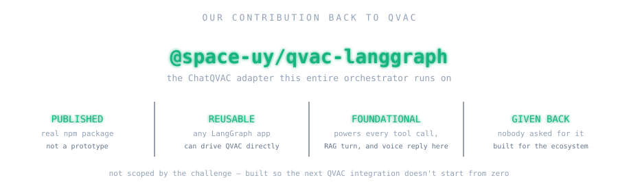
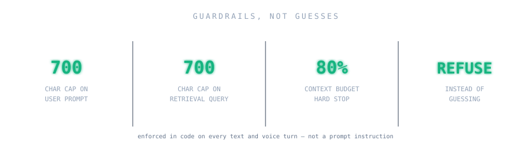

  

  <strong>Private company knowledge. Available anywhere. Without sending it anywhere.</strong>

  <code>LOCAL INFERENCE</code>
  &nbsp;·&nbsp;
  <code>LOCAL RAG</code>
  &nbsp;·&nbsp;
  <code>LOCAL VECTOR STORE</code>
  &nbsp;·&nbsp;
  <code>NO CLOUD AI</code>
  &nbsp;·&nbsp;
  <code>OFFLINE READY</code>

  QVAC / llama.cpp · BGE-M3 · LanceDB · cached local models

  <a href="https://youtu.be/WKsw_oYwkUI"><strong>▶ Watch the demo video</strong></a>
   
  Chat, voice, vision, cancellation, and P2P delegation with local fallback, presented as to Meridian.

<h2>What this is</h2>

  Meridian Assistant runs <strong>AI inference and knowledge retrieval locally</strong>
  for Meridian Components. It answers questions from sales, support, and field
  engineering using Meridian's documents and inventory as context.

  Inference, document retrieval, embeddings, voice, and vision run on
  Meridian-controlled hardware. The API is OpenAI-compatible, but requests do
  not rely on a hosted AI provider.

  <strong>Built with:</strong>
  <code>@qvac/sdk</code>
  · LangGraph
  · LanceDB
  · Express
  · React

<h2>The problem</h2>

  

  Meridian had previously tested a cloud-based AI solution. That approach
  introduced three main issues: variable cost, customer data leaving Meridian
  hardware, and answers that were not reliable enough for business use.

<blockquote>
  Meridian Assistant was built around those constraints and keeps the main
  request path on local infrastructure.
</blockquote>

<h2>What we built</h2>

<table>
  <tr>
    <td width="25%" valign="top">
      <strong>Backend</strong>  
      <code>Express + QVAC</code>  
      Local lifecycle, RAG, tools, voice, and inference.
    </td>
    <td width="25%" valign="top">
      <strong>Frontend</strong>  
      <code>React + Vite</code>  
      Streaming chat, citations, voice, vision, and engine status.
    </td>
    <td width="25%" valign="top">
      <strong>Knowledge</strong>  
      <code>LanceDB + corpus/</code>  
      Persisted local retrieval over Meridian documents.
    </td>
    <td width="25%" valign="top">
      <strong>Tools</strong>  
      <code>stock-tool</code>  
      Deterministic inventory through structured tool calls.
    </td>
  </tr>
</table>

  No outbound call to a cloud model provider exists in the production dependency path.

<h2>Our contribution back to QVAC</h2>

  

  <a href="https://www.langchain.com/langgraph"><strong>LangGraph</strong></a> by
  <a href="https://www.langchain.com/">LangChain</a> has become a widely adopted
  orchestration framework for building AI agents and complex workflows.

  We built and published
  <a href="https://github.com/SpaceUY/qvac-langgraph"><strong><code>@space-uy/qvac-langgraph</code></strong></a>,
  a reusable adapter that bridges LangGraph with <strong>QVAC</strong>.
  It makes QVAC behave like a native LangChain chat model, supporting
  <code>invoke()</code>, <code>stream()</code>, and <code>bindTools()</code>.

  This lets developers use LangGraph for orchestration, tools, routing, state, and streaming,
  while QVAC handles local or delegated inference underneath, without cloud AI dependencies
  or per-token fees.

  Meridian Assistant uses the published package in its production orchestration path
  for RAG, tool calling, streaming, text, and voice.

  <strong>Open-source repository:</strong>
  <a href="https://github.com/SpaceUY/qvac-langgraph">
    github.com/SpaceUY/qvac-langgraph
  </a>

<h2>Deployment comparison</h2>

  

<table>
  <tr>
    <td width="20%" valign="top">
      <strong>Local-first</strong>  
      Inference, embeddings, and retrieval stay controlled.
    </td>
    <td width="20%" valign="top">
      <strong>Grounded</strong>  
      Citations come from retrieved corpus evidence.
    </td>
    <td width="20%" valign="top">
      <strong>Adaptive</strong>  
      Models change with available hardware.
    </td>
    <td width="20%" valign="top">
      <strong>Resilient</strong>  
      P2P delegation falls back locally.
    </td>
    <td width="20%" valign="top">
      <strong>Compatible</strong>  
      OpenAI-compatible API surface.
    </td>
  </tr>
</table>

<h2>Key capabilities</h2>

<table>
  <tr>
    <td><strong>Chat</strong></td>
    <td><code>POST /v1/chat/completions</code></td>
    <td>Streaming, grounding, and structured tools</td>
  </tr>
  <tr>
    <td><strong>Citations</strong></td>
    <td><code>citations: [{file, score}]</code></td>
    <td>Derived from retrieved evidence</td>
  </tr>
  <tr>
    <td><strong>Voice</strong></td>
    <td><code>/v1/chat/voice-completions</code></td>
    <td>Speech in, streamed speech out</td>
  </tr>
  <tr>
    <td><strong>Vision</strong></td>
    <td><code>image_url</code></td>
    <td>JPEG / PNG + WebP transcoding</td>
  </tr>
  <tr>
    <td><strong>RAG</strong></td>
    <td><code>BGE-M3 + LanceDB</code></td>
    <td>Incremental ingestion · top-15 → min score 0.551 → max 3 chunks</td>
  </tr>
  <tr>
    <td><strong>P2P</strong></td>
    <td>Public-key peer</td>
    <td>Delegation with automatic local fallback</td>
  </tr>
</table>

<h2>Benchmark results</h2>

  

  The numbers reported in this repository come from project benchmarks. We also
  kept the results of experiments that performed worse, since some of those
  tests changed which features were enabled in the final implementation.

  <a href="docs/i4-native-addon-results.md">Native embedding benchmark</a>
  ·
  <a href="docs/i2-simultaneous-completions-results.md">Continuous batching benchmark</a>
  ·
  <a href="docs/bundle-size-report.md">Bundle report</a>
  ·
  <a href="docs/i6-performance-analysis.md">Profiler performance analysis</a>

<h2>Architecture</h2>

  

  One <code>AgentService</code>, one compiled LangGraph graph, and one QVAC model session
  handle both text and voice through the same pipeline.

<table>
  <tr>
    <td><strong>Express routers</strong></td>
    <td>Parse, validate, stream SSE, cancel on client disconnect</td>
  </tr>
  <tr>
    <td><strong>AgentService</strong></td>
    <td>Singleton orchestrator; shared by the text and voice routes</td>
  </tr>
  <tr>
    <td><strong>LangGraph graph</strong></td>
    <td>RAG once, then LLM ⇄ tools until no tool call remains</td>
  </tr>
  <tr>
    <td><strong>ChatQVAC</strong></td>
    <td>Our own <code>@space-uy/qvac-langgraph</code> adapter, makes QVAC look like any LangChain chat model</td>
  </tr>
  <tr>
    <td><strong>QvacChatSession</strong></td>
    <td>Model lifecycle, FIFO concurrency, delegation, mid-session recovery</td>
  </tr>
  <tr>
    <td><strong>Voice wrapper</strong></td>
    <td>Sentence-by-sentence TTS queue over the same AgentService output</td>
  </tr>
  <tr>
    <td><strong>ResilientEmbeddingService</strong></td>
    <td>Native C++ embeddings with automatic SDK fallback</td>
  </tr>
  <tr>
    <td><strong>LanceDB</strong></td>
    <td>Persisted local vector search</td>
  </tr>
  <tr>
    <td><strong>ModelManagementService / QvacRuntimeAdapter</strong></td>
    <td>Discover → download → load → infer → unload → close</td>
  </tr>
  <tr>
    <td><strong>Local model / Meridian peer</strong></td>
    <td>Optional P2P delegated inference, automatic local fallback</td>
  </tr>
</table>

<h2>How a request flows</h2>

  

  RAG runs once before inference. The LLM may loop through structured tools
  multiple times while tokens stream directly to the client. Citations are
  selected after the graph completes.

<h2>Engineering decisions</h2>

  

<h2>Hardware-aware inference</h2>

  

  The application selects a hardware tier when the backend starts. Available
  resources determine whether it uses the <code>low</code>, <code>medium</code>,
  or <code>high</code> configuration. The tier can also be set manually with
  <code>QVAC_RESOURCE_TIER=low|medium|high</code>.

<h2>Security</h2>

  

  No cloud AI provider exists in the production request path.
  Documents, embeddings, retrieval, transcription, and text-to-speech
  processing remain local.

  Optional delegated chat inference can reach only a configured
  Meridian-controlled peer identified by public key.

<table>
  <tr>
    <td><strong>.lancedb/</strong></td>
    <td>Local vector store</td>
  </tr>
  <tr>
    <td><strong>.qvac-cache/</strong></td>
    <td>Downloaded model weights</td>
  </tr>
  <tr>
    <td><strong>.run/</strong></td>
    <td>Process state</td>
  </tr>
  <tr>
    <td><strong>.env</strong></td>
    <td>Peer configuration</td>
  </tr>
  <tr>
    <td><strong>~/.qvac/kv-cache</strong></td>
    <td>Session KV-cache, deleted when a new conversation starts</td>
  </tr>
</table>

<h2>Runtime limits</h2>

  

  The runtime enforces several limits for local inference. User prompts and
  retrieval queries are capped at 700 characters. This prevents long pasted
  inputs or transcriptions from exceeding the embedding input budget. A
  conversation is stopped when it reaches 80% of the 16,384-token context
  window. This leaves enough context available for the remaining generation.
  If a request has no retrieved document evidence, image evidence, or tool
  result, the backend returns <code>INSUFFICIENT_CONTEXT</code> without
  citations. In that case the model is not asked to generate an unsupported
  answer.

  The values are defined in <code>MAX_PROMPT_CHARS</code>,
  <code>MAX_RETRIEVAL_QUERY_CHARS</code>, and
  <code>CONTEXT_BUDGET_THRESHOLD</code>. Each one is covered by tests and
  enforced by the application rather than through prompt instructions.

<h2>Quick start</h2>

<pre><code>npm ci
npm run ingest --workspace=apps/backend
npm run dev:server
npm run dev:client</code></pre>

  First run requires internet once to cache model weights.
  Full backend and P2P setup:
  <a href="apps/backend/README.md"><code>apps/backend/README.md</code></a>.

  <strong>Or with Docker:</strong> a production-compiled image (no dev tooling in the final
  container) running the P2P provider/server demo on a private network:

<pre><code>npm run models:fetch --workspace=apps/backend
npm run ingest --workspace=apps/backend
cp .env.example .env
docker compose up --build</code></pre>

  <code>.qvac-cache/</code> and <code>.lancedb/</code> are host volumes, not baked into the
  image, so both commands above have to run on the host first. The <code>server</code>
  container refuses to start without an ingested vector store. Once up, the
  <code>server</code> container exposes the same OpenAI-compatible API on <code>:3001</code>,
  delegating chat inference to the <code>provider</code> container by public key, with
  automatic local fallback if it's unreachable. <code>.env.example</code> ships demo peer
  identities for local testing; generate fresh ones with
  <code>npm run seed:generate --workspace=apps/backend</code>.

<h2>Local verification</h2>

  

<ol>
  <li><code>npm ci</code></li>
  <li><code>npm run build:server</code></li>
  <li><code>npm run models:fetch</code></li>
  <li><code>npm run corpus:ingest</code></li>
  <li><code>npm run serve</code></li>
  <li>Wait for <code>GET /v1/models</code> → <code>200</code></li>
  <li><strong>Disconnect outbound network</strong></li>
  <li>Send a grounded completion</li>
  <li>Verify <code>citations[]</code></li>
</ol>

<pre><code>curl -X POST http://127.0.0.1:3001/v1/chat/completions \
  -H "Content-Type: application/json" \
  -d '{"messages":[{"role":"user","content":"What was Q2 2026 total revenue?"}]}'</code></pre>

<strong>Challenge requirements coverage</strong>

 

  ✅ Implemented &nbsp;·&nbsp;
  🧪 Tested / demonstrated &nbsp;·&nbsp;
  ⚠️ Partial or documented limitation

<table>
  <tr>
    <th>Requirement</th>
    <th>Status</th>
    <th>Evidence</th>
  </tr>

  <tr>
    <td>[1.2] Model weights excluded from installer</td>
    <td align="center">✅</td>
    <td><code>docs/bundle-size-report.md</code></td>
  </tr>

  <tr>
    <td>[1.4] Cancel response in progress</td>
    <td align="center">✅ 🧪</td>
    <td><code>chat.router.ts</code> · frontend stop control</td>
  </tr>

  <tr>
    <td>[2.1] No invented stock data</td>
    <td align="center">✅ 🧪</td>
    <td><code>stock-tool</code></td>
  </tr>

  <tr>
    <td>[2.2 / 2.3] Persisted local vector store</td>
    <td align="center">✅</td>
    <td>LanceDB + direct <code>embed()</code>/<code>ragChunk()</code></td>
  </tr>

  <tr>
    <td>[2.4] Conversation UI</td>
    <td align="center">✅</td>
    <td><code>message-list.tsx</code></td>
  </tr>

  <tr>
    <td>[3.1] Structured tool-call loop</td>
    <td align="center">✅ 🧪</td>
    <td>Zod + LangGraph tool events</td>
  </tr>

  <tr>
    <td>[3.1.1] Corpus inventory tool</td>
    <td align="center">✅</td>
    <td><code>listDocumentsTool.ts</code></td>
  </tr>

  <tr>
    <td>[3.1.2] Stock-tool dataset</td>
    <td align="center">✅</td>
    <td><code>stock-tool/</code></td>
  </tr>

  <tr>
    <td>[5.1 / 5.1.1] Runtime visible in UI</td>
    <td align="center">✅</td>
    <td><code>engine-panel.tsx</code></td>
  </tr>

  <tr>
    <td>[5.2] Hardware-aware model selection</td>
    <td align="center">✅ 🧪</td>
    <td><code>resourceTier.ts</code> · <code>models.config.ts</code></td>
  </tr>

  <tr>
    <td>[6.1.2] Citations surfaced</td>
    <td align="center">✅</td>
    <td><code>citation-sources.tsx</code></td>
  </tr>

  <tr>
    <td>[6.1.3] Deterministic reruns</td>
    <td align="center">✅ 🧪</td>
    <td>temperature / seed + deterministic citation sort</td>
  </tr>

  <tr>
    <td>[6.1.4] Offline server start</td>
    <td align="center">✅</td>
    <td><code>models:fetch</code></td>
  </tr>

  <tr>
    <td>[6.2.1] Plugin-scoped SDK</td>
    <td align="center">✅</td>
    <td><code>qvac.config.mjs</code></td>
  </tr>

  <tr>
    <td>[6.2.2] Bundle report</td>
    <td align="center">✅ 🧪</td>
    <td><code>docs/bundle-size-report.md</code></td>
  </tr>

  <tr>
    <td>[6.3] Session KV-cache reuse</td>
    <td align="center">✅</td>
    <td><code>X-Meridian-Session</code></td>
  </tr>
</table>

<h4>Extra mile</h4>

<table>
  <tr>
    <th>Improvement</th>
    <th>Status</th>
  </tr>

  <tr>
    <td>LangGraph ↔ QVAC integration</td>
    <td>✅ 🧪 Published as <code>@space-uy/qvac-langgraph</code> on npm — see <a href="#our-contribution-back-to-qvac">above</a></td>
  </tr>

  <tr>
    <td>Continuous batching</td>
    <td>⚠️ High tier only after measured regression on medium</td>
  </tr>

  <tr>
    <td>Native C++ embedding path</td>
    <td>✅ 🧪 Primary path with automatic SDK fallback</td>
  </tr>

  <tr>
    <td>LoRA fine-tuning</td>
    <td>⚠️ Attempted and documented as blocked upstream</td>
  </tr>

  <tr>
    <td>P2P resilience</td>
    <td>✅ 🧪 Heartbeat, fallback and recovery</td>
  </tr>

  <tr>
    <td>TurboQuant KV cache</td>
    <td>⚠️ Implemented but disabled pending validation</td>
  </tr>

  <tr>
    <td>Performance instrumentation</td>
    <td>✅ 🧪 Opt-in <code>profiler.exportJSON()</code> export + reproducible benchmark — see <a href="docs/i6-performance-analysis.md">analysis</a></td>
  </tr>
</table>

 

  <strong id="technical-challenges--known-limitations">
    Known limitations
  </strong>

 

<table>
  <tr>
    <td valign="top"><strong>Benchmark correctness</strong></td>
    <td>
      The original native-embedding benchmark reported an unrealistic ~36× improvement.
      A blocking PowerShell RSS sampler was distorting the measurement.
      The benchmark was fixed before the result was used to justify the architecture.
    </td>
  </tr>

  <tr>
    <td valign="top"><strong>Continuous batching</strong></td>
    <td>
      QVAC's <code>batchCompletion()</code> schema did not preserve the required KV-cache behavior.
      Concurrent <code>completion()</code> calls were used instead.
      Medium-tier testing showed a regression, so that tier remains sequential.
    </td>
  </tr>

  <tr>
    <td valign="top"><strong>Vision</strong></td>
    <td>
      Two images in one message reproducibly crash the current upstream QVAC / llama.cpp worker.
      Production therefore limits messages to one image.
    </td>
  </tr>

  <tr>
    <td valign="top"><strong>LoRA</strong></td>
    <td>
      Fine-tuning was attempted against the production model and a supported control model.
      The production architecture is rejected and the control path crashes before producing an adapter.
      No successful adapter is claimed.
    </td>
  </tr>

  <tr>
    <td valign="top"><strong>P2P recovery</strong></td>
    <td>
      Heartbeats and reconciliation were added around the SDK so a disappearing provider
      causes automatic local recovery rather than a stalled session.
    </td>
  </tr>

  <tr>
    <td valign="top"><strong>SDK version pin</strong></td>
    <td>
      The project currently uses <code>@qvac/sdk</code> 0.18.2. Development and
      testing of the delegated inference path were done against this version,
      so the dependency is pinned rather than automatically upgraded.
      Moving to a newer SDK version requires regression testing of local
      inference, P2P delegation, model lifecycle, and the OpenAI-compatible API.
    </td>
  </tr>
</table>

<h2>Team</h2>

  Built by <strong>SpaceDev</strong> for the QVAC Solutions Service Provider
  Qualification Exercise, Meridian Components scenario.

